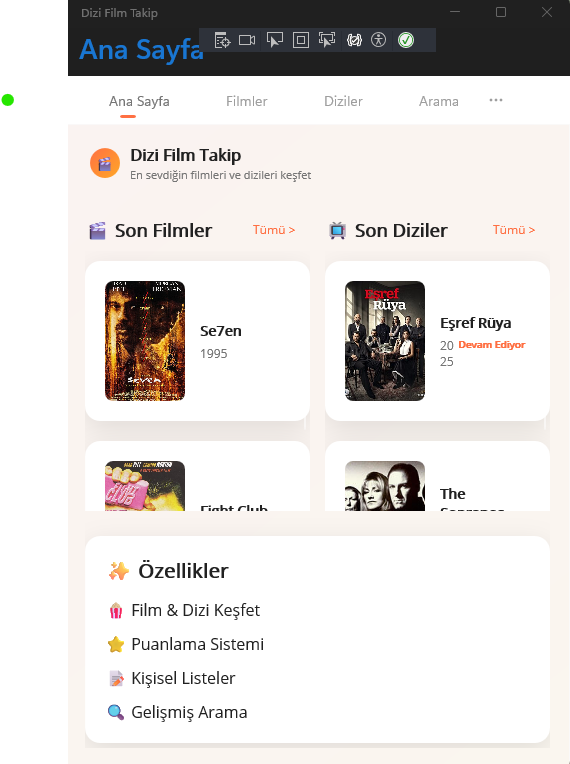
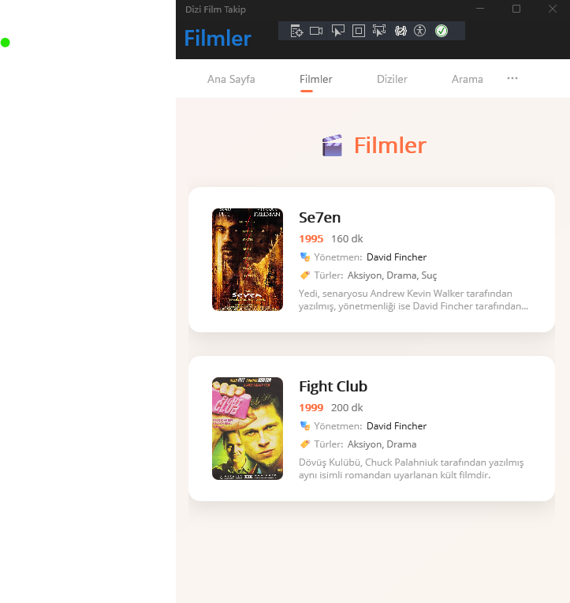
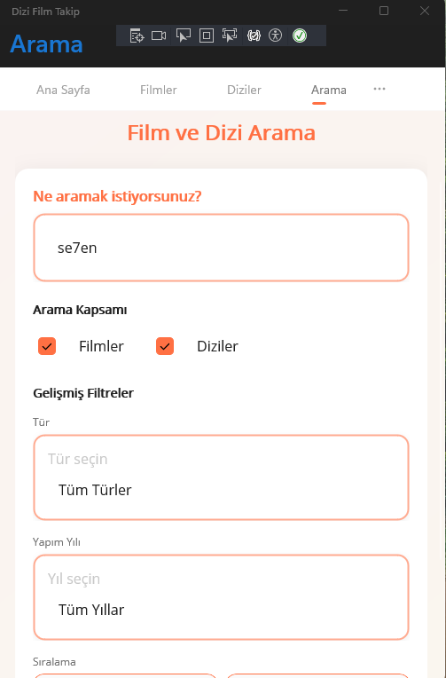
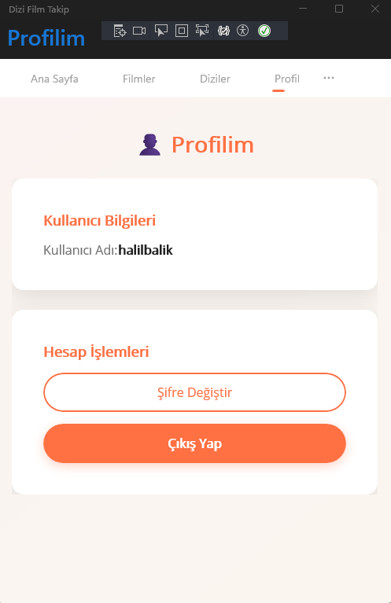
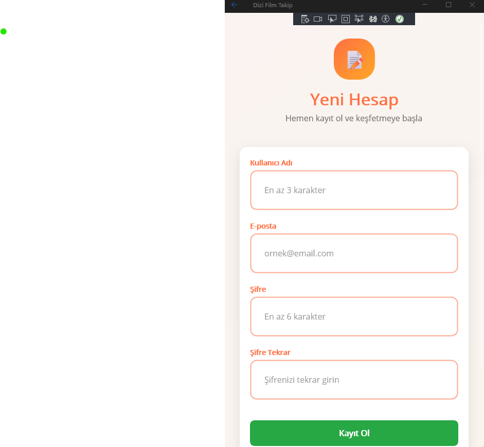

# DiziFilmTanitim

Programlama 2 dersi kapsamında geliştirilmiş film ve dizi tanıtım uygulaması. Kullanıcılar film/dizi listelerini görüntüleyebilir, kendi listelerini oluşturabilir ve içerikleri değerlendirebilir.

## Proje Yapısı

```
DiziFilmTanitim/
├── DiziFilmTanitim.Core/     # Entity modelleri ve Interface'ler
├── DiziFilmTanitim.Api/      # Minimal API projesi
└── DiziFilmTanitim.Maui/     # MAUI mobil uygulaması
```

## Teknolojiler

- .NET 9
- MAUI (Multi-platform App UI)
- ASP.NET Core Minimal API
- Entity Framework Core
- SQL Server Express
- MVVM Pattern

## Uygulama Görselleri

<table>
  <tr>
    <td align="center">
      
      <br>
      <b>Ana Sayfa</b>
      <br>
      <em>Uygulamanın ana ekranı ve popüler içerikler</em>
    </td>
    <td align="center">
      
      <br>
      <b>Filmler</b>
      <br>
      <em>Film listesi ve kategorileri</em>
    </td>
  </tr>
  <tr>
    <td align="center">
      
      <br>
      <b>Arama</b>
      <br>
      <em>Film ve dizi arama özelliği</em>
    </td>
    <td align="center">
      
      <br>
      <b>Profil</b>
      <br>
      <em>Kullanıcı profili ve ayarlar</em>
    </td>
  </tr>
  <tr>
    <td align="center">
      
      <br>
      <b>Giriş Sayfası</b>
      <br>
      <em>Kullanıcı giriş ekranı</em>
    </td>
    <td align="center">
      
      <br>
      <b>Kayıt Sayfası</b>
      <br>
      <em>Yeni kullanıcı kaydı</em>
    </td>
  </tr>
</table>

## Hızlı Başlangıç

1. Projeyi klonlayın
2. `dotnet restore` komutu ile paketleri yükleyin
3. API projesini çalıştırın: `dotnet run --project DiziFilmTanitim.Api`
4. MAUI uygulamasını çalıştırın: `dotnet run --project DiziFilmTanitim.Maui`

## Özellikler

- Film ve dizi listeleme
- Detaylı arama ve filtreleme
- Kullanıcı kayıt/giriş sistemi
- Kişisel liste oluşturma
- Puanlama sistemi
- Profil yönetimi

Bu proje Programlama 2 dersi kapsamında akademik amaçlarla geliştirilmiştir.
